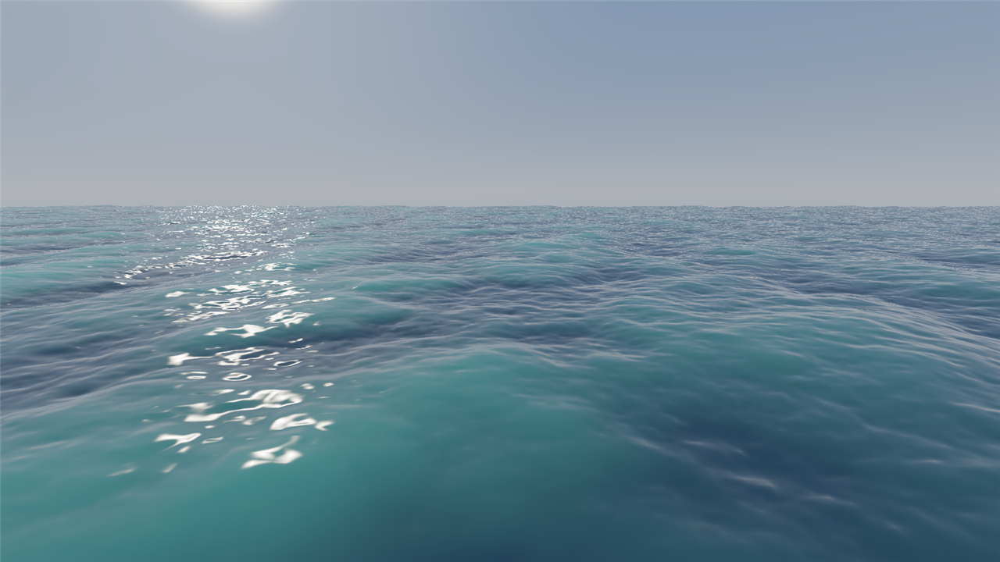
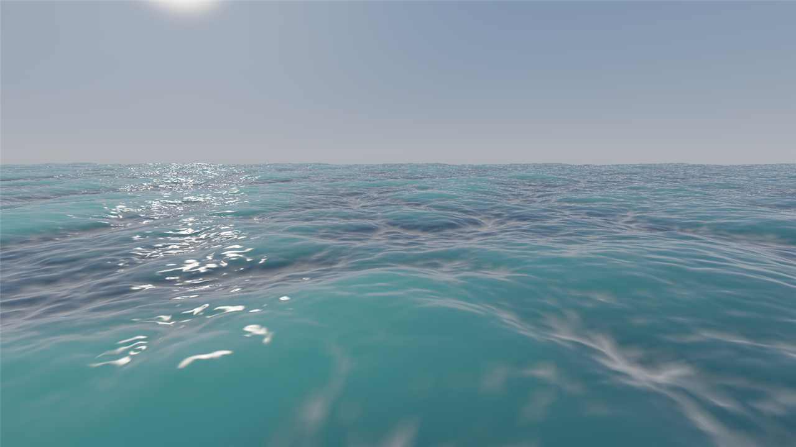
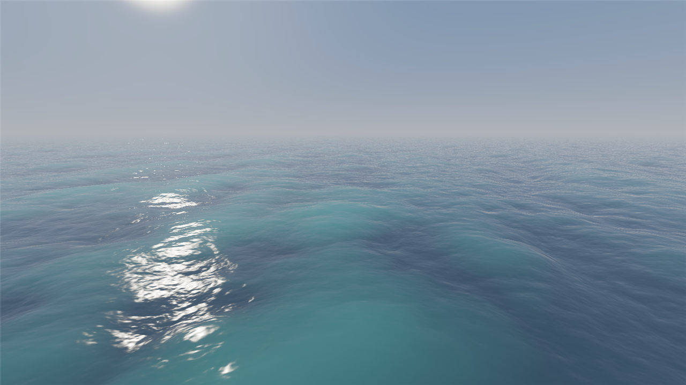
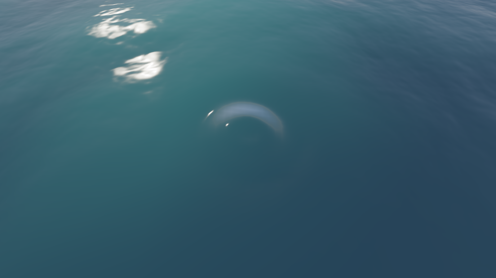

# oceanlib

[](LICENSE)

A small, dependency-free, engine-agnostic C++20 library for real-time ocean
waves: a JONSWAP directional spectrum, an in-tree multithreaded SIMD FFT, and
CPU-side displacement / normal / foam buffers any renderer can upload.



512x512 waves update in **1.43 ms** on an i7-14700HX - 16.6x faster than
the first working version. Above: the included
Vulkan viewer, 256x256 grid tiled 7x7, 6.4M triangles. The sun glitter is not
an effect - it falls out of the wave slopes in the normal buffer.



At 22 m/s with heavier chop, foam appears along the crests. It is driven by the
Jacobian of the horizontal displacement - the actual measure of the surface
folding onto itself - not by a height threshold.



Three cascades (800/150/25 m patches) summed into one surface: big rolling
swell, mid-scale chop, and fine ripple detail all at once - the range a single
patch cannot cover without compromising one scale for another.

## Why it exists

Four promises, and every one of them is tested rather than asserted:

1. **Runs on anything.** A multithreaded, SIMD-optimised CPU FFT is the
   baseline, so it works on hardware with no compute shaders. Scalar, SSE2,
   AVX2 and NEON kernels ship in one binary and are selected by CPUID - and
   they are **bit-identical to each other**, so the ocean never depends on
   which CPU drew it.
2. **Physics matches visuals.** `height_at(x, z)` returns exactly what the
   renderer displays, with no GPU readback. Because choppy displacement moves
   vertices sideways, that is a fixed-point inversion rather than a lookup:
   measured mean error 0.01 mm against 21.8 mm for a naive direct lookup.
3. **Deterministic.** Same seed and time give byte-identical buffers: across
   runs, across thread counts, across SIMD levels, and across platforms - the
   library ships its own PRNG, its own normal distribution and its own
   sine/cosine precisely so that nothing depends on a vendor's libm.
4. **Easy to integrate.** The output buffers are laid out as RGBA32F textures,
   so uploading the whole ocean is two `memcpy`s and two image copies.

## What it does and doesn't do

**Does:** a JONSWAP directional wave spectrum (optionally finite-depth), an
FFT-based CPU displacement/normal/foam field per patch, exact world-space
height/normal/foam queries against what's actually drawn, multi-scale
cascades (several patches at different scales summed into one sea state),
optional 3-D orbital velocity, **local interaction** (objects disturb the
water, the disturbance propagates, reflects off hulls and is visible to
queries), and a reference Vulkan viewer to see it in.

**Doesn't do:** GPU compute (the FFT is CPU-only, by design - see promise
#1), foam *advection* (foam is a per-frame Jacobian threshold, not simulated
particles that persist and drift), buoyancy or rigid-body solving (you get
`height_at`/`sample_at`; physics integration is yours), rendering (the
viewer is a reference integration, not an engine), or non-power-of-two grid
sizes (the FFT is radix-2). Shallow water gets the correct dispersion
relation but not a re-derived TMA spectrum shape - see `SpectrumDesc::depth`.

## Building

```sh
cmake -S . -B build -DCMAKE_BUILD_TYPE=Release
cmake --build build
ctest --test-dir build
```

Options: `OCEAN_BUILD_TESTS` (ON), `OCEAN_BUILD_BENCH` (ON),
`OCEAN_BUILD_EXAMPLES` (OFF), `OCEAN_BUILD_VIEWER` (OFF).

With tests off, the build needs no network and no external dependency of any
kind. doctest is fetched only for tests; Vulkan and GLFW are needed only for
the viewer.

### CMake FetchContent

```cmake
include(FetchContent)
FetchContent_Declare(oceanlib
  GIT_REPOSITORY https://github.com/DarshanVShah/oceanlib.git
  GIT_TAG        v1.0.0)
set(OCEAN_BUILD_TESTS OFF CACHE BOOL "" FORCE)
set(OCEAN_BUILD_BENCH OFF CACHE BOOL "" FORCE)
FetchContent_MakeAvailable(oceanlib)

target_link_libraries(your_target PRIVATE ocean::ocean)
```

## Using it

The whole integration, five lines:

```cpp
ocean::OceanDesc desc;
desc.spectrum.wind_speed = 12.0f;       // m/s
ocean::Ocean sim{desc};                 // everything allocates here, once
sim.update(absolute_time_seconds);      // per frame - no heap allocation
float water_height = sim.height_at(x, z);
```

In context, with the buffers a renderer actually needs:

```cpp
#include "ocean/ocean.hpp"

ocean::OceanDesc desc;
desc.size                = 256;
desc.patch_length        = 200.0f;   // metres per tile
desc.spectrum.wind_speed = 12.0f;    // m/s
desc.seed                = 1337;

ocean::Ocean sim{desc};              // everything allocates here, once

// per frame - performs no heap allocation
sim.update(absolute_time_seconds);

const ocean::Buffers b = sim.buffers();
// b.displacement : N*N*4 floats, (dx, dy, dz, foam)
// b.normal       : N*N*4 floats, (nx, ny, nz, jacobian)
// Both are exactly RGBA32F textures. Upload and sample.

// Physics, agreeing exactly with what is drawn:
float water_height = sim.height_at(boat_x, boat_z);
```

### C API

For bindings from C, Rust, C#, Python, Swift, or any host that speaks the C
ABI. Declared in `include/ocean/ocean.h`.

```c
#include "ocean/ocean.h"

ocean_desc desc;
ocean_desc_init(&desc);              // fills defaults, sets struct_size
desc.spectrum.wind_speed = 12.0f;

ocean_status status;
ocean_sim* sim = ocean_create(&desc, &status);

ocean_update(sim, absolute_time_seconds);
ocean_buffers b = ocean_get_buffers(sim);
float water_height = ocean_height_at(sim, x, z);

ocean_destroy(sim);
```

To plug in an engine's scheduler instead of the built-in thread pool, set
`desc.parallel_for` to anything with the shape of `ParallelFor` /
`IJobParallelFor` + `Complete()` / `tbb::parallel_for`.

## The viewer

```sh
cmake -S . -B build -DOCEAN_BUILD_VIEWER=ON
cmake --build build
./build/examples/viewer/ocean_viewer
```

Needs the Vulkan SDK (for headers and `glslc`); GLFW is fetched automatically.

| key | action | key | action |
|-----|--------|-----|--------|
| WASD / QE | move | mouse + RMB | look |
| Shift | move faster | Tab | wireframe |
| Space | pause time | R | reset camera |
| 1 / 2 | choppiness | Esc | quit |
| **LMB** | **drop a rock** | **I** | **wake only** |
| - / = | impulse strength | [ / ] | impulse radius |

Left click ray-marches against the *displaced* surface - not the flat y = 0
plane - and drops a rock where it lands. `I` isolates the interaction field
from the swell so the ripples can be read on their own.

Flags: `--size N --mesh M --tiles T --wind U --chop C --foam F --wireframe
--screenshot out.bmp --frames N --interaction N --splash FRAME --isolate
--impulse S --impulse-radius R --cam-x/y/z V --cam-yaw/--cam-pitch V`.



A rock dropped into a wind sea: the ring is summed with the swell in both
geometry and shading. `docs/v3-wake-only.png` is the same moment with `I`
held - the interaction field alone.

## Performance

Measured, not projected. Full methodology, stage breakdowns and how each
number was reached: [BENCHMARKS.md](BENCHMARKS.md).

**Machine:** Intel Core i7-14700HX (8 P-cores + 12 E-cores, 28 threads), no
AVX-512. MSVC 19.44.35208, CMake `Release`, Ninja. Flags: `/O2 /Ob2 /DNDEBUG
-std:c++20 -MD /W4 /permissive- /fp:precise`.

**512x512 `Ocean::update()`, one build at a time, serial and threaded (ms):**

| build                             | serial (ms) | threaded (ms) |
|------------------------------------|------------:|--------------:|
| scalar, single-threaded            |      23.620 |             - |
| + threads (28 hw threads)          |      25.558 |          2.919 |
| + AVX2 FFT (naive)                 |      18.301 |          2.422 |
| + batched FFT columns              |      13.371 |          1.913 |
| + own polynomial sincos            |      12.234 |          1.862 |
| + floor-based phase fold           |      11.805 |          1.608 |
| + AVX2 evolve                      |   **8.378** |      **1.426** |

**16.6x overall** from the scalar single-threaded baseline: a 512x512 ocean
updates in 1.43 ms, leaving 15.2 ms of a 60 Hz frame for everything else.
`height_at()` costs well under a microsecond.

## Documentation

- **[ARCHITECTURE.md](ARCHITECTURE.md)** - every design decision and why,
  including the alternatives rejected and the bugs each choice avoids.
- **[BENCHMARKS.md](BENCHMARKS.md)** - measured numbers only, with the CPU,
  compiler and flags they were taken on.

## Status

v1.0.0. Spectrum, FFT, threading, SIMD, queries, C API, cascades
(`ocean::CascadeStack`), shallow-water dispersion, NEON verified under
aarch64 QEMU emulation, and the Vulkan viewer are all done.

Cascades are C++ only for now - no `ocean_cascade_*` C API yet. That, plus
foam advection, GPU compute, and time-looped baking, are the plan for v1.1
and beyond.
